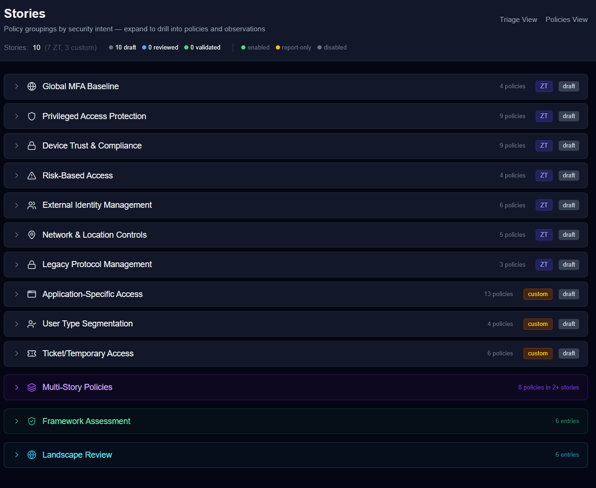
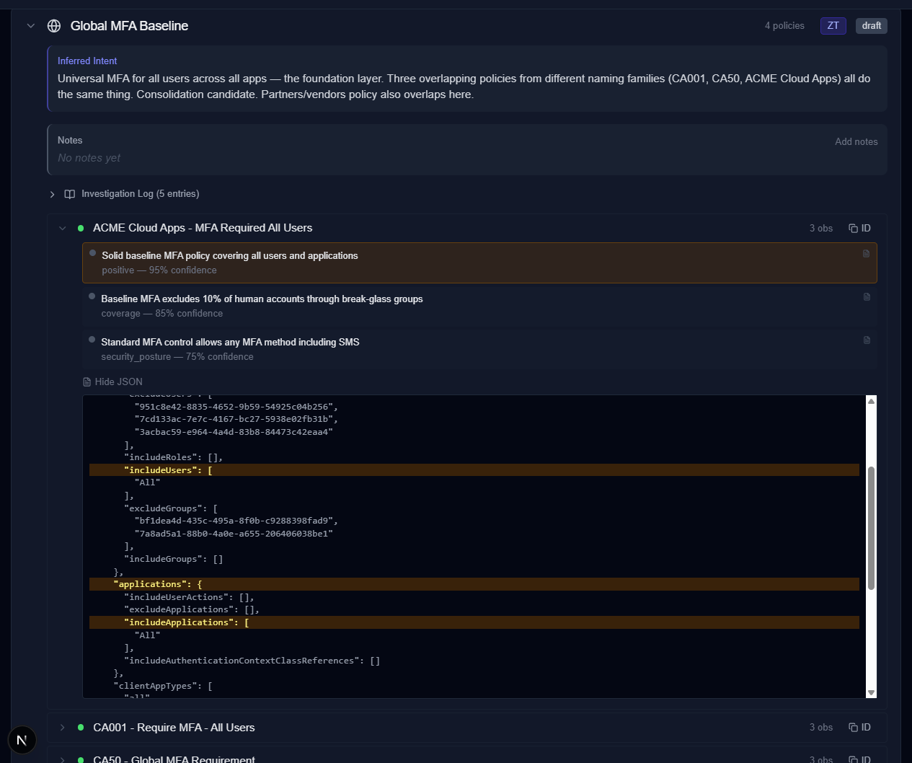

I'm a systems and infrastructure engineer. Microsoft, networking, identity — 17 years of it. I have no background in AI. No formal qualifications in machine learning or data science. Nothing that makes me credible in that space. I don't write about AI. I troubleshoot servers and untangle Conditional Access policies and read between the lines in customer meetings.

I'm telling you this upfront because it matters for what comes next.

Over many months — squeezed into lunch breaks, evenings, and weekends around my actual day job — I built an AI-powered system that analyses Microsoft Conditional Access policies. The kind of complex, overlapping security configurations that make senior consultants reach for spreadsheets and swear words. The tool that's popped out produces expert-level analysis. Not "pretty good for AI" but analysis that, when I compared it against my own review of the same environment, held up completely.

And that scared me more than it impressed me.

---

## The Moment I Knew AI Was Real

This wasn't my first encounter. A few years ago — GPT-3 or maybe 4, I don't remember exactly — I asked AI to solve a problem using Azure products. This was a specific solution I'd come up with myself, one I'd used in a job interview to demonstrate that I could connect dots across infrastructure, networking, and Azure to create a non-obvious answer to a real-world problem. It was one of my "look how clever I am" examples.

The AI got it on the second try. First attempt was close, I gave it a bit more context, and round two nailed it. My clever, non-obvious solution that I'd been proud of for years — produced in two prompts.

That was the moment I stopped thinking AI was a flash in the pan. Not because it was perfect, but because it demonstrated a kind of reasoning I hadn't expected. It could connect dots.

## The Experiment

About 12–16 months ago, I built a Graph API tool that used gitops in a way similar to Terraform — JSON config files compiled at runtime, compared against live Intune policies, with drift reporting and deployment. It worked, but it was too hard for most people to use.

So I started asking a different question: what would it look like to rebuild this AI-first? Not AI-assisted. AI-first. Like "cloud-first" back in the day — not just putting existing things in the cloud, but rethinking from the ground up.

I had no playbook for this. I just started chasing butterflies — following threads, trying things, seeing what stuck. Conditional Access policies are genuinely hard. A tenant with 55 overlapping policies is complex enough that a human struggles to hold it all in memory. I wanted to know how far AI could actually be pushed on something this complicated — and honestly, I didn't think it would work. I thought if I could reach 80% of this undefined goal, I was shooting for the stars. I expected to find the wall.

Here's the thing: I answered the original question in the first week. Claude Code produced JSON policy files and deployed them to Entra via the Graph API. It could compare configurations, explain the differences, make changes, and walk through what was about to happen — all in the terminal. The gitops tool isn't built yet, but the hard question was answered: the AI could do the work. The rest is plumbing — wire it together, add approval gates, build the workflow.

But somewhere along the way — I genuinely can't tell you when — I stopped working on the tool and started pulling on something else entirely. I never decided to build a reasoning engine. I just kept following threads because progress never stopped and there were always hints at more.

## What I Actually Built

This wasn't a single clever prompt. It's a multi-layer reasoning system — four layers of AI agents handling different types of thinking, each feeding the next. 14 production prompt files. Around 3,200 lines. Seven major iterations. Months of chat sessions across multiple concurrent conversations — an architecture session holding design thinking, test sessions running prompts, implementation sessions writing code, and sometimes a session just to park an idea so I wouldn't lose it.

But I should be clear about what I actually built, because I've been calling it a "tool" and that's not quite right. The tool — the thing that will eventually manage policy lifecycles through gitops, drift detection, and AI-assisted changes with human review — that's mostly plumbing. Known patterns. The thing I don't quite have a name for is the reasoning engine underneath it. A system designed to take raw policy data it's never seen before and discover what's there.

That's the design choice I'm most proud of. Nothing in the system is specific to one customer. The architecture is built to create the conditions for expert-level analysis to surface from the data, rather than prescribing what the analysis should contain. You point it at a tenant and it figures out what the story is.

The system groups policies into "stories" based on what they're actually trying to achieve, investigates each story by following threads wherever they lead, maps the tenant against the CISA Zero Trust Maturity Model, and synthesises everything into a landscape review. The test tenant produced 10 stories across the estate.

Much of the design emerged from feedback loops I didn't plan. I'd run a prompt designed to act as an agent, ask it what worked and what felt constraining, take that feedback back to a separate architecture conversation — a long-running Claude chat session — and redesign. The agents told me that framework comparison was getting deprioritised when context got tight, so I redesigned the pipeline to run the framework assessment *before* the investigation — pre-loading context so the investigator absorbs it naturally. I didn't realise how well it worked until my review confirmed the maturity ratings without me having read them myself. The design came from a loop between sessions, not from a whiteboard.

One thing I learned the hard way: words matter far more than I expected. Early versions used language like "findings" and "report" — and the model would shift into catastrophic thinking. Everything was urgent, everything was critical. I had to discover, through iteration, that the word "observation" produced fundamentally different reasoning than the word "finding." Observations are exploratory. Findings are judgmental. That single word changed everything about the output.

I'm including the landscape summary — the final handover — in full, because it's the thing that made me sit up:

> *This is an environment that was built three times by three different teams and never consolidated. You are looking at roughly 55 Conditional Access policies across an Australian-based tenant. They fall into three naming families — CA0xx (the most structured, likely a security project), ACME Cloud (team-driven, application-focused), and CORP_ (infrastructure/operations flavour). Each wave added policies for the same security objectives without retiring the previous wave. The result is three global MFA policies, three legacy auth blocks, two guest blocks, two Salesforce policies, and five admin MFA layers — all enabled, all doing roughly the same thing with slightly different exclusion groups.*
>
> *The Zero Trust posture sits at Initial maturity across most pillars, with Identity reaching toward Advanced. Universal MFA, high-risk blocking, geo-fencing, legacy auth blocking, and guest default-deny are all in place and enforced. The foundations are genuinely solid. What is missing is the next step: five report-only policies represent a stalled maturity upgrade — phishing-resistant MFA for admins, broad device compliance, mobile app protection, risk remediation, and per-app authentication strength. Three of those five have a name-config mismatch where the policy name claims a control that the configuration does not actually enforce.*
>
> *Two enabled policies enforce nothing at all — they include and exclude the same group, a configuration error that renders them invisible. One of these was supposed to provide admin session timeouts that no other policy delivers. A ticket-driven policy named Temporary Full Access is quietly the strictest policy in the estate, accidentally providing the device compliance gate that a properly-named policy was designed for but never configured.*
>
> *Pay attention to the guest access model first. Two block-all-guests policies with different exclusion lists interact with an allow-guests-to-SharePoint policy, and in Conditional Access block always wins. The designed intent — block all guests except approved ones for SharePoint and Teams — may not actually work. This is the one thread where the security posture might be weaker than anyone realises, and it is testable with a single guest sign-in.*
>
> *The story of this environment is accretion without governance. Each implementation era did reasonable work for its time, but nobody came back to retire the previous era or verify the new policies actually enforced what their names claimed. The engagement is not about finding the tenant insecure — it is about helping them finish what they started, clean up what accumulated, and verify that what they think is working actually is.*

My first reaction was: well sugar — I'm out of a job.

Remember — I didn't think this would work. I expected to find the wall, and I expected it much sooner. I thought I'd get the 80% version: accurate but mechanical, useful for grunt work, obviously AI-generated. This isn't that. This reads like the output of a senior consultant who spent days with the tenant. The narrative framing, the prioritisation, the specific call-out on the guest model as the thread to pull first — that's not pattern matching on a template. That's judgment. And the system discovered all of it. I didn't tell it to look for three naming families, or to frame the environment as "accretion without governance" (I had to look up what "accretion" even means), or to prioritise the guest access model. It followed threads through the data and arrived at those conclusions because the evidence led there.

And the summary is just the tip. Underneath it, the pipeline had already found that the ticket-driven "Temporary Full Access" policy was quietly the strictest in the entire estate. It had mapped orphaned directory references and identified that deleted group references in a guest-blocking policy may have silently changed who can access what. It had modelled that the 55-policy estate could potentially shrink to as few as 25 with equivalent or better coverage. It had produced a customer engagement framework — start with what's working, move to quick wins, then open the strategic conversation — with specific per-story recommendations for each phase.

Roughly 180 total observations across 3 layers of reasoning, each one traceable back through the layers to the specific JSON policy data that generated it. Not hallucinated. Not templated. Reasoned.

I still haven't found the wall.

## Where the Boundary Actually Sits

The knee-jerk reaction — "AI will replace consultants" — isn't right. But the comfortable reaction — "AI is just a tool, it still needs us" — isn't right either. The truth is somewhere more specific and more uncomfortable.

Here's something important about how I tested this: I didn't design the tenant's policies myself. I had Claude build the environment based on Microsoft best practices, mixed with patterns typical of real-world enterprise environments and some deliberately planted misconfigurations. I didn't read the policies before my review — and I didn't read the planted issues either. I hid them in a directory and didn't dig them up until after everything had run. Seventeen years of watching technology fail spectacularly will do that to you — I trust nothing until I've tried to break it, and I wanted no way to unconsciously steer my review toward what I knew was there.

I did a full manual review of the entire tenant — 10 policy stories, 13 detailed consultant entries. Then I compared what I found against what the pipeline had produced. Every thread the AI identified was confirmed. Nothing was wrong or overstated. It caught basically every planted issue — the only miss was traceable to a tenant migration, not a reasoning failure.

But the comparison showed precisely where the boundary sits.

The AI identifies. The consultant prescribes. The pipeline found that two policies enforced nothing because their include and exclude groups were identical. It caught naming inconsistencies and orphaned references. All correct. But it couldn't design the target architecture — the two-pronged privileged access model, the five-tier device trust framework, the six-policy consolidation map. That requires knowing what "good" looks like from years of seeing environments.

The AI flags. The consultant frames. The pipeline noted a policy as "unusual." I connected it to the underlying concern — MFA fatigue for office workers — and the modern solution: device trust through Primary Refresh Tokens carrying MFA claims on compliant devices. The AI saw the anomaly. I understood the paradigm shift behind it.

The AI surfaces. The consultant sequences. The pipeline found that two ticket-based policies were accidentally providing device compliance enforcement. I flagged the dependency: do not retire these until the replacement is in place, and here's the specific migration order. Knowing what breaks when requires judgment that the tool doesn't have.

There's one more example that sticks with me. The pipeline looked at the four or five overlapping MFA policies — each with different exclusion groups scoped at different levels — and connected them to a defence-in-depth architecture. Layered exclusions as layered security. I dismissed it quickly, because my experience picked up that the three different naming conventions in both the policies and the exclusion groups were not "clean" in the way a defence-in-depth architecture would warrant — this read like misconfiguration. But the reasoning path was not wrong. The observation was astute — if you looked at the exclusion scoping alone, a defence-in-depth interpretation is defensible. It was a connection I wouldn't have made myself. Having it pointed out, I could see exactly how the AI got there, and I'd encountered similar reasoning in customer conversations where teams justified accidental complexity as intentional design. The AI didn't just match my expertise — it made an adjacent connection that made me think.

So no, AI doesn't replace the senior consultant. But it compresses the work dramatically and occasionally sees things the consultant doesn't. The days of spreadsheet analysis, the manual cross-referencing, the slow pattern recognition across 55 policies — the system does that in minutes. What's left is the higher-value work: prescribing architectures, framing conversations, sequencing changes, asking the questions that open up the real discussion with the customer.

If this scales — and that's still an "if," tested against one environment so far — the implications are real. Fewer consultants needed per engagement. Not zero. But fewer. And that's not just a junior-level disruption — the pattern recognition and synthesis that the tool handles is senior-level work.

There's another side to this too. Plenty of organisations can't afford to bring in a senior consultant to review their CA policies. They know their environment has accumulated complexity, they know things probably aren't configured how they should be, but a proper review isn't in the budget. If a tool like this can be made reliable across diverse environments, it makes that analysis accessible to organisations that currently go without. That's not just disruption — that's expansion of who gets access to expert-level security review.

## The Part Nobody Told Me

Here's the thing I had to figure out entirely on my own, and I think it matters.

The tool didn't start by producing that landscape summary. For the first several iterations, the output was technically accurate and completely useless. Every finding was correct. The formatting was clean. And I would not have taken it within a mile of a customer meeting.

The standard prompt engineering advice — be specific, use numbered steps, define output formats, provide examples — produced output that read like an audit checklist. Thorough and useless.

What turned the project around was realising that the problem wasn't the AI. The raw intelligence was there — I'd seen glimpses of genuinely expert-level observations at various points. The problem was me. I was getting in its way. I assumed the issue was that I wasn't articulating the task clearly enough, that I needed better prompts. But it was actually a knowledge problem. I needed to understand how **I** actually analysed these environments — not how I thought I did, but how I actually did — and design conditions where the model's existing knowledge could work the same way.

I stumbled into the breakthrough by accident. I was frustrated — I could see the AI had the raw capability but I couldn't articulate what was missing, couldn't explain the gap between technically correct output and actually useful analysis. I vented to Claude about it, and somewhere in that conversation it said something like "what you're describing sounds like Cognitive Task Analysis" — structured extraction of expert tacit knowledge, the stuff you know but can't easily explain. I had no idea what that was. I asked Claude to research it, then said "let's run a session — I'm the expert, you're the advisor." A few sessions later, the knowledge was on the page.

And here's the part I find genuinely confronting. When I later asked the AI to distil everything I'd shared across those sessions, it compressed the entire unlock — six sessions across probably as many hours — down to four principles on a page:

- The output serves a conversation, not a verdict.
- Visible reasoning matters more than correct conclusions.
- Technical artifacts are organisational X-rays.
- Hold judgment until you have context.

That's it. Seventeen years of consulting experience — the thing I'm trusted and paid for, the thing that makes me the person in the room — distilled to four bullet points on an A4 page. And none of it was technical. The model already knew (or through tooling could look up) everything about CA policies, Zero Trust frameworks, security architecture. What it was missing was a professional posture — how a consultant uses that knowledge when they have to walk into a room and have a productive conversation with someone about their mess. Once it had that frame, the reasoning changed completely.

Sit with that for a second. How much of any senior knowledge worker's "irreplaceable expertise" is four or five principles on a page? How thin is the veil between "years of hard-won experience" and "a few honest conversations with an AI advisor"? I don't find this scary exactly — more fascinating than threatening — but I'd be lying if I said it didn't make me feel exposed. And the extraction process wasn't some elaborate research project. It was figuring out the question to ask and being willing to sit with the answer. That's a low barrier. Most people won't do it — but the ones who refuse won't be protected by that refusal forever, because eventually someone in their field will.

That was the jump. The system went from technically correct to genuinely useful in one fell swoop, not because of better prompting techniques, but because I learned to tease out capabilities the model already had by giving it the professional context for how to deploy them.

And the specific thing I learned: for the analytical layers — the investigation, the synthesis, the landscape review — I had to remove structure, not add it. No numbered steps. No "identify 3–5 findings per category." No phases. Instead, I described who the AI should be, gave it rich context, told it what *not* to do (no severity language, no declarative statements, no anchoring to numbers), and got out of the way. The constraints in my prompts are about creating the right conditions for reasoning, not prescribing the reasoning itself.

Numeric targets made the model produce exactly that many findings regardless of evidence. Numbered steps made it execute mechanically without adapting. Structure that helps with straightforward tasks — extraction, classification, formatting — actively degraded the expert reasoning I needed. I don't think this is widely understood yet, and I had nothing to guide me. I had to figure it out by running the system hundreds of times, evaluating output against my own expertise, going back and forth in chat sessions for hours about why something didn't feel right, and iterating until it clicked.

## Why I'm Writing This

Most people I talk to still think AI is a toy — good for drafting emails and summarising documents, not for real analytical work. The landscape summary above wasn't produced by some cutting-edge research system. It was produced by a commercially available model, prompted by someone with no AI background, running against a test tenant. I didn't have a playbook. I didn't have a mentor in this space. I had domain expertise, curiosity, and a Claude subscription. And many months of my own time and money, squeezed around a full-time consulting job — plenty of evenings and weekends where the sensible thing would have been to stop.

I don't think "anyone can build this" is honest. But the barrier is effort, curiosity and stubbornness, not credentials or specialist knowledge. And if I can figure this out on the side, without a guide, people with dedicated time and more resources will get there faster.

Part of me is still half waiting for the gotcha I missed — the thing that unravels the whole result. That's probably just 17 years of IT talking, because the evidence is there, and I can't unsee it.

The reasoning engine — the thing that analyses an environment it's never seen, discovers the story, and produces output I validated blind — that's the part I keep coming back to. Not the gitops tool. Not the plumbing. The part where I gave an AI four principles about how a consultant thinks, and it started reasoning like one. Whatever that is, it keeps me up at night. Not because it's a threat, but because I don't fully understand the implications of what it means that I was able to build it.

Maybe CA policies are uniquely suited to this approach. Maybe it won't replicate. But what if it does? What if even a subset of senior knowledge work — the complex analytical stuff that people believe requires years of experience — turns out to be similarly accessible once someone is willing to sit with the extraction process? I didn't manufacture any of this. The emergence was genuine — the system discovered things I didn't tell it to look for, made connections I wouldn't have made, and produced a narrative I didn't template. None of that was designed on purpose. It fell out of the process.

I'm sharing it because I think people in my field should see what's possible right now — not what's theoretically possible, but what one person actually built and validated on the side, in between the real job. Whether that's exciting or unsettling probably depends on where you're sitting. For me, it's both.

---

*[Matt Graham](https://www.linkedin.com/in/matthewgrahamau/) is a cloud consultant specialising in the Microsoft ecosystem, based on the Sunshine Coast, Australia. The system described in this post analyses Conditional Access policies using the Microsoft Graph API with AI-powered reasoning. All analysis was produced against a test tenant built to represent a realistic enterprise environment. No customer data was used.*
